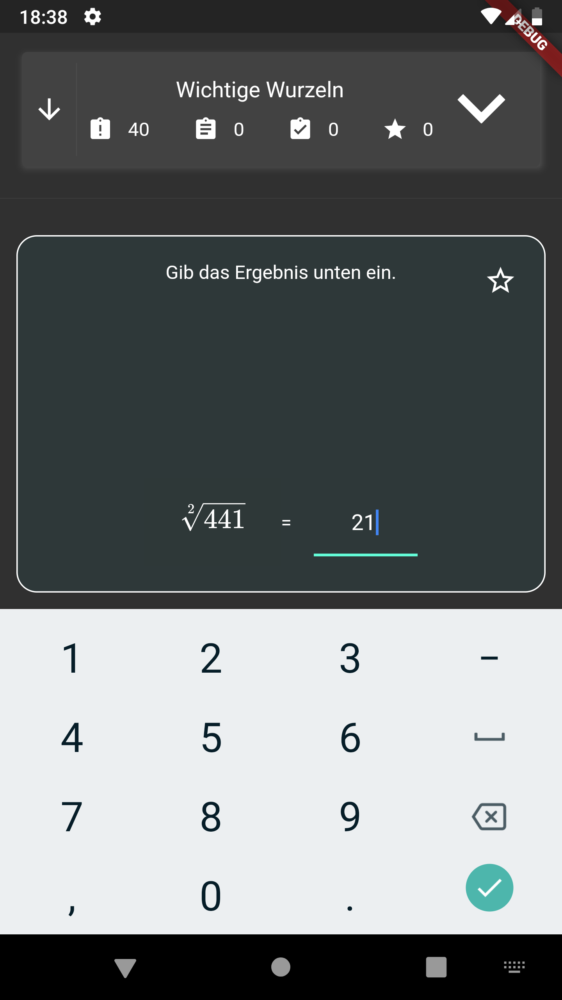

# MVK Mnemonic (Merkhilfe)

## Was ist das?

'MVK Merkhilfe' ist eine App zum Auswendiglernen von wichtigen mathematischen Formeln und Äquivalenzen.

## Screenshots

Übersicht | Menü | Aufgaben-Screen 1
: --- :|: --- :|: --- :
 |  | 
**Aufgaben-Screen 2** | **Aufgaben-Screen 2**
 | 

## Installation

1. Lade dir die aktuelle Version der App für die Prozessorarchitektur deines Smartphones herunter.
Falls du dir bei der Architektur unsicher bist: Versuche zunächst die 'arm'-Bauweisen.

2. Stelle sicher, dass du Fremdquellen-Installationen zugelassen hast. Halte hierzu das 'Dateimanager'-Icon lange 
gedrückt und gehe zu den App-Infos. Recht weit unten sollte die Option 'Unbekannte Apps installieren' aktiviert sein.
Je nach Android-Oberfläche kann sich die Option auch nur woanders finden lassen. Probiere es dann unter Einstellungen
\> Allgemein

3. Öffne den Ordner, in welchem sich die .apk befindet, und tippe sie an. Es öffnet sich der Installer.

4. Jetzt musst du nur noch 'Installieren' wählen. Fertig!

## Updates

Um ein Update zu installieren, befolge einfach die Schritte unter 'Installation'.
Du musst die App davor **nicht** deinstallieren.

## Lizenz

Die Lizenz dieses Projektes ist die MIT-Lizenz. Diese gilt nicht für Flutter-Sourcecode, Flutter-Binaries sowie anderen
Code aus dem App-Template ['flutter_view'](https://github.com/flutter/flutter/tree/master/examples/flutter_view).
Siehe [Lizenz](LICENSE) für weitere Informationen. Beachte bitte auch die Lizenzinfos der .apk-Dateien und 
innerhalb der App unter 'App-Infos'.

## Bugs

Bugs bitte gerne unter 'Issues' melden und den Fehler genau beschreiben. Auch Feature-Vorschläge sind willkommen.

## Sonstiges

Bisher ist der Sourcecode leider noch kaum dokumentiert. o_O

#### Viel Spaß und Erfolg beim Lernen!
